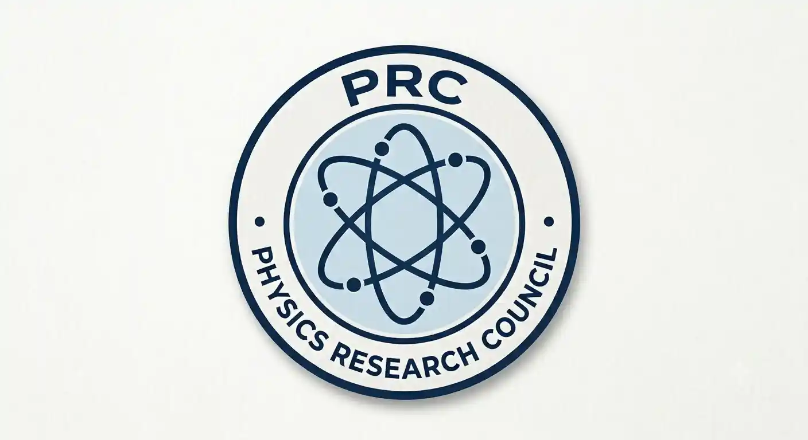

<div align="center">



# Physics Research Council

### National Olympiad & Scientific Outreach Initiative

**Free • Open-Access • Student-Led • Merit-Based**

[](https://physicsresearchcouncil.github.io/physicsresearchcouncil/)
[](https://forms.gle/LELL9oS6o5jXi4vG7)
[](mailto:physicsresearchcouncil@gmail.com)

[Instagram](https://www.instagram.com/physicsresearchcouncil/) · [X / Twitter](https://x.com/PhyResearch) · [YouTube](https://www.youtube.com/@PhysicsResearchCouncil) · [Medium Blog](https://medium.com/@physicsresearchcouncil)

</div>

---

## 🌌 About the Council

The **Physics Research Council** is a decentralized, zero-budget scientific outreach initiative dedicated to making high-level physics education, competitions, and research pathways accessible to every motivated student — regardless of school, location, or financial background.

We believe scientific potential is distributed globally, even when educational resources are not. Through free competitions, open problem sets, volunteer training, and an international Scientific Advisory Committee, we build bridges between secondary-school students, undergraduates, and professional physicists.

> **Mission:** Lower the barrier of entry into the physical sciences by providing free, rigorous, and inclusive academic opportunities.

---

## 🏆 The Physics Championship 2026

A multi-round competitive examination designed to test physical reasoning, mathematical derivation, and research ability — completely free of charge.

| Round | Format | Focus |
|-------|--------|-------|
| **Round 1** | Online MCQ + Numerical (60 min) | Conceptual filter — logic, dimensional analysis, foundational laws |
| **Round 2** *(Optional)* | Portfolio / CV submission | Research projects, simulations, literature reviews — up to +25 bonus |
| **Round 3** | Olympiad Theory (3 hours) | Multi-stage derivation problems at IPhO / USAPhO standard |

### Divisions
- **Division A** — Classes 9 & 10  
- **Division B** — Classes 11–12 & Gap Year  
- **Division C** — College Undergraduates (1st & 2nd Year, any major)

📄 [Rules & Syllabus](competition_syllabus_and_rules.md) · [Round 1 Samples](sample_problems/round1_sample_questions.md) · [Round 3 Samples](sample_problems/round3_olympiad_problems.md)

---

## 🤝 Student Volunteer Intake

We are actively recruiting student volunteers across all academic levels (Class 9 through undergraduate). **No prior physics experience is required** for operational roles — full training is provided.

### Volunteer Domains
| Domain | Description |
|--------|-------------|
| **Outreach & Email Communications** | Inviting schools, sponsors, and advisors |
| **Social Media Management & PR** | Instagram, LinkedIn, X, Discord |
| **Graphic Design & Content Creation** | Event flyers, posts, visual assets |
| **Web Development & Portal Admin** | HTML/CSS portal, databases |
| **Event Operations & Logistics** | Timelines, scheduling, Q&A boards |
| **Physics Grading & Problem Design** | Reviewing submissions & quizzes *(recommended for physics majors / Olympiad alumni)* |
| **General Operational Support** | Flexible help wherever needed |

**Benefits**  
- Official Certificate of Appreciation  
- Public contributor listing  
- Access to a niche academic community, ambitious peers, and the physics network in India  
- Occasional sponsor perks  
- Flexible remote commitment  

> This is an **unpaid volunteer role**. We do not currently offer a monetary stipend, though one may be introduced in the future.

🚀 **[Apply to Volunteer →](https://forms.gle/LELL9oS6o5jXi4vG7)**

---

## 🧑‍🏫 Scientific Advisory Committee

Professors, postdoctoral researchers, and educators who oversee syllabus design, validate exam papers, and evaluate research portfolios. Membership is honorary and voluntary (≈2–4 hours per semester).

Interested in joining the Advisory Board?  
Email **physicsresearchcouncil@gmail.com** with your CV.

---

## 📚 Resources & Blog

- [Symmetry and Conservation: The Legacy of Noether's Theorem](https://medium.com/@physicsresearchcouncil/symmetry-and-conservation-the-legacy-of-noethers-theorem-70b9cf8cdb83)  
- [All Medium articles](https://medium.com/@physicsresearchcouncil)  
- Sample problems and handbooks in this repository

---

## 🔗 Connect With Us

| Platform | Link |
|----------|------|
| 🌐 Website / Portal | [physicsresearchcouncil.github.io](https://physicsresearchcouncil.github.io/physicsresearchcouncil/) |
| 📸 Instagram | [@physicsresearchcouncil](https://www.instagram.com/physicsresearchcouncil/) |
| 🐦 X / Twitter | [@PhyResearch](https://x.com/PhyResearch) |
| ▶️ YouTube | [@PhysicsResearchCouncil](https://www.youtube.com/@PhysicsResearchCouncil) |
| ✍️ Medium Blog | [@physicsresearchcouncil](https://medium.com/@physicsresearchcouncil) |
| ✉️ Email | [physicsresearchcouncil@gmail.com](mailto:physicsresearchcouncil@gmail.com) |
| 📝 Volunteer Form | [Google Form](https://forms.gle/LELL9oS6o5jXi4vG7) |

---

## 📂 Repository Structure

```
├── index.html / styles.css / app.js   → Public portal
├── competition_syllabus_and_rules.md → Championship rules
├── sample_problems/                  → Round 1 & 3 sample sets
├── operations/                       → Internal ops docs & scripts
├── outreach_templates/               → Invitation & sponsor templates
└── README.md                         → This file
```

---

## 🔍 SEO & Keywords

**Primary:** Physics Research Council, free physics olympiad, student physics competition India, open-access physics education, National Physics Championship 2026  

**Secondary:** physics volunteer opportunities, high school physics contest, undergraduate physics research outreach, IPhO-style problems free, physics grading volunteer, STEM student leadership India  

**Long-tail:** free online physics championship for class 9 10 11 12, zero cost physics olympiad for college students, student-led physics research council, physics problem design volunteer India

---

<div align="center">

**Built by students, guided by researchers, open to everyone.**

© 2026 Physics Research Council. All rights reserved.  
Organized as a free, open-access youth scientific outreach initiative.

[Apply to Volunteer](https://forms.gle/LELL9oS6o5jXi4vG7) · [Contact Us](mailto:physicsresearchcouncil@gmail.com)

</div>
